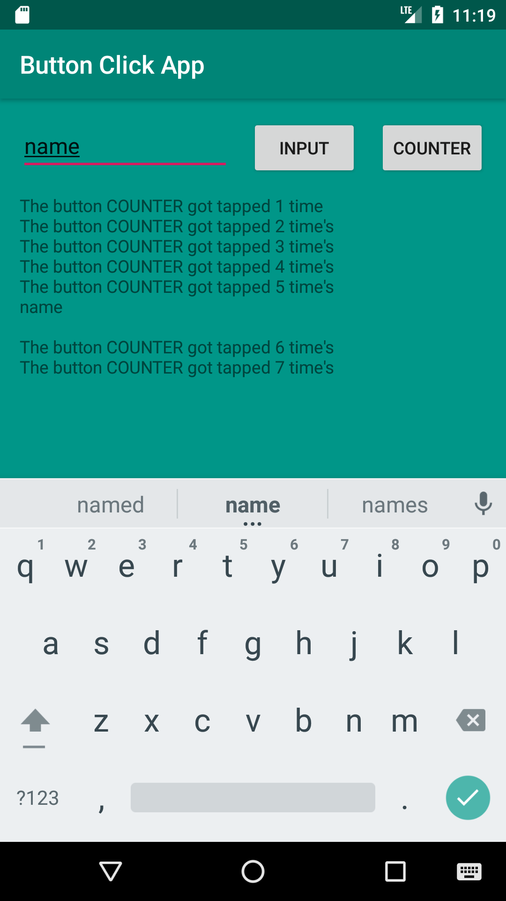

<article>
	<h1>ButtonClickApp</h1>
	
Is The first app that I made with a counter and the ability to input text in a TextView via a TextInput field. It also restores printed information on rotation of the screen.

</article>

<article>
	<h2>Images:</h2>
	

		
	

	

		
	

</article>