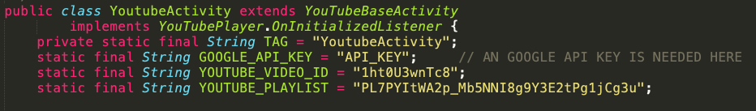
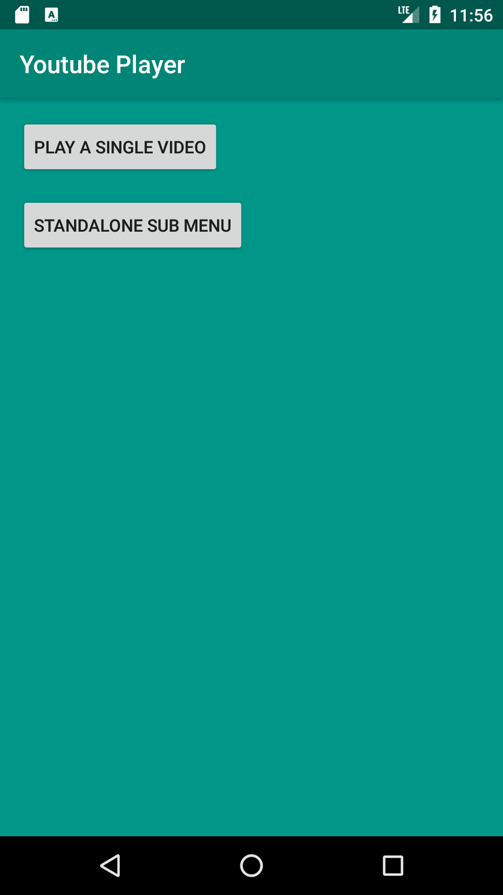
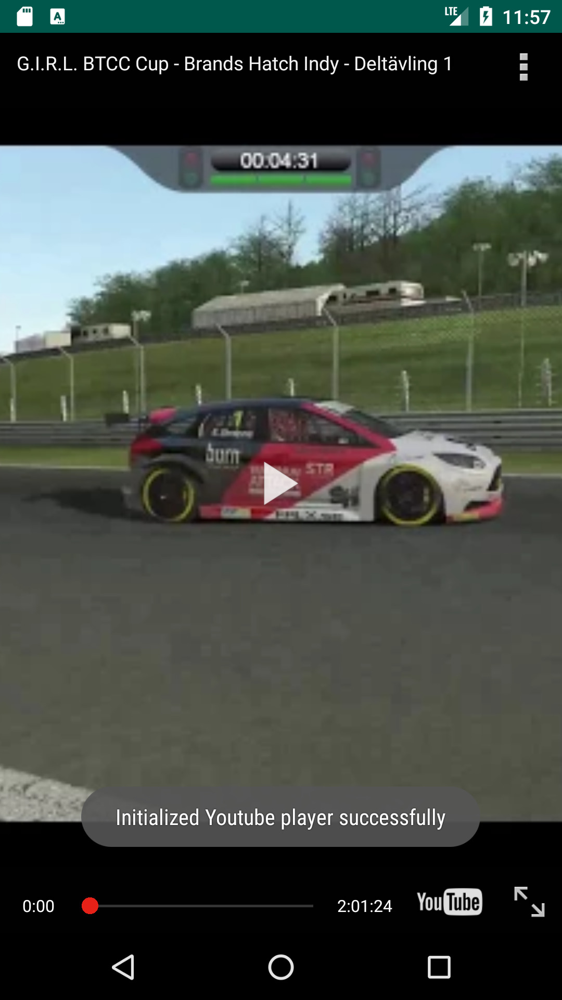
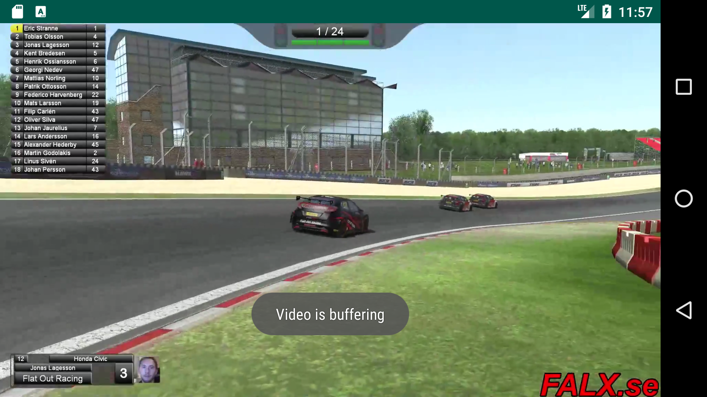
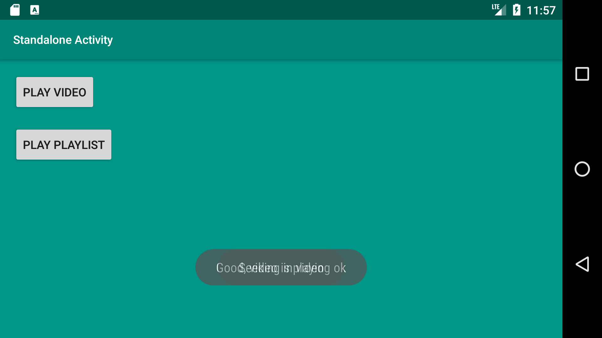
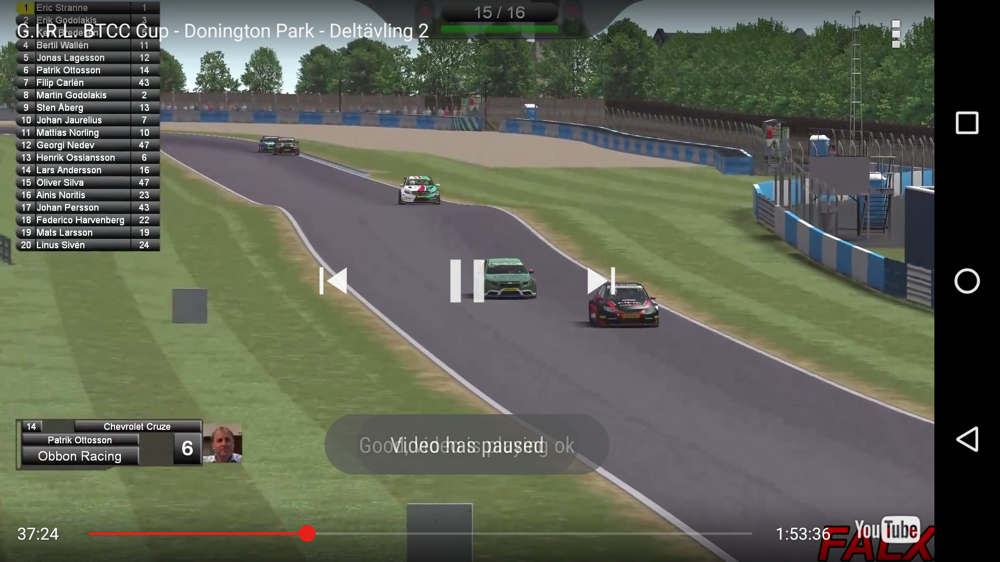
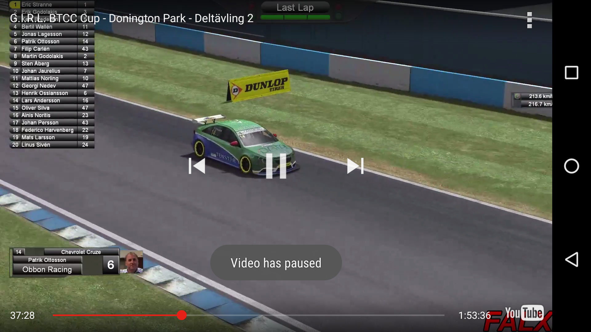

<article>
	<h1>YoutubePlayer</h1>
	
This app plays a single specified video from Göteborg Internet Racing League and also one off the playlists.

	
Livetiming can be followed <a href="http://gbgracing.liveracers.com/live">here</a>

	
G.I.R.L.s <a href="gbgracing.org">homepage</a>

	
G.I.R.L.s <a href="https://www.youtube.com/channel/UCUVl3Pwf3IagQPf3LJwkZRg">YouTube</a>

</article>

<article>
	<h2>Note</h2>
	
If you want to use or test this code and test it out, you have to add your own API-key from Google.

	

		
	

</article>

<article>
	<h2>Images:</h2>
	

		
	

	

		
	

	

		
	

	

		
	

	

		
	

	

		
	

</article>

